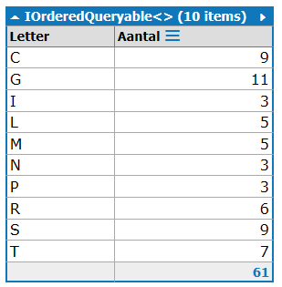

#.NET Technology

##Oefeningenreeks : Linq

O. Sourie, W. Schokkelé, F. Vlummens / Howest - Toegepaste Informatica

###Oefeningenreeks1: basisqueries

**oefeningen1.linq**

Gebruik volgende declaratie:
``List<int> numbers = new List<int> { 20, 35, 17, 105, 90 };``

Maak Linq-queries die volgende data tonen

1. de getallen deelbaar door 5
2. het grootste getal
3. het voorlaatste getal

Gebruik volgende declaratie:
``List<string> games = new List<string> { "Dominion", "Manillen", "Schaken", "Kolonisten van Catan", "Cluedo"};``

Maak Linq-queries die volgende data tonen

4. Het aantal letters van alle spellen samen, zonder spaties
5. Per spel een zin: 
***naam van het spel*** kost € ***nummer uit eerste lijst op dezelfde positie*** 


###Oefeningenreeks 2: custom class

**Oefeningen2.linq**

Je start met volgende code:

```
public List<Student> students;

void Main()
{
	students = new List<Student> {
			new Student { Id= 1, FirstName = "Freddie", LastName = "Fish", Age = 18 , Sex = "M"},
			new Student { Id= 2, FirstName = "Bill", LastName = "Jones", Age = 21, Sex = "M" },
			new Student { Id= 3, FirstName = "Kitty", LastName = "Cat", Age = 19, Sex = "F" },
			new Student { Id= 4, FirstName = "Suzy", LastName = "Wan", Age = 20, Sex = "F" }
					   };
		// oplossingen
}

public class Student
{
	public int Id { get; set; }
	public string FirstName { get; set; }
	public string LastName { get; set; }
	public int Age { get; set; }
	public string Sex { get; set; }
}
```

Maak Linq-queries die volgende data tonen

1. studenten waarbij de voor- en familienaam start met dezelfde letter
2. de gemiddelde leeftijd van de vrouwelijke studenten
3. student met de grootste code
De code wordt als volgt berekend: code = id² + 5


<p style="page-break-after:always;"></p>

###Oefeningenreeks 3: Linq met database Northwind

**oefeningen3.linq**

1. Toon de productnamen waarvan we minder dan 20 UnitsInStock tellen, toon ook de bijbehorende categorienaam
2. Toon de namen van de klanten waar in de ContactTitle het woord "sales" voorkomt en afkomstig zijn uit Italië
3. Toon de namen van de klanten waar in de ContactTitle het woord "sales" voorkomt en afkomstig zijn uit Italië, Frankrijk of Portugal
4. Geef voor elke werknemer die een overste heeft (reportsto is ingevuld) de voornaam en familienaam weer alsook hoeveel orders ze hebben behandeld in het meest recente jaar
5. Toon de eerste letter en het aantal ProductNames dat met deze letter begint.
      We zien enkel de letters waarvoor er meer dan 2 producten zijn.


